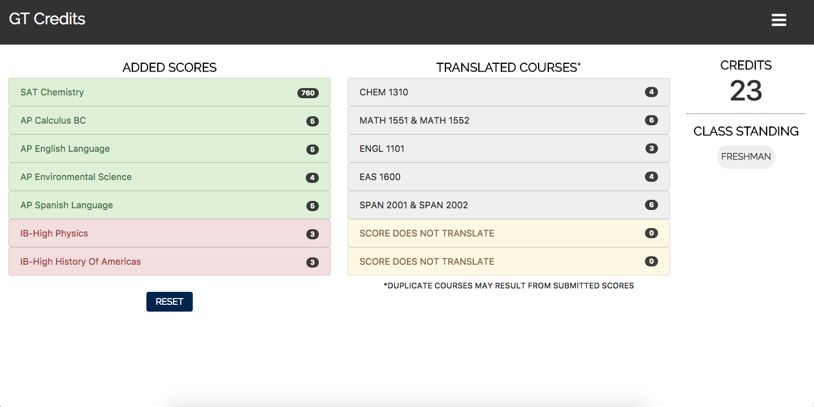

# GT Credits

Currently, incoming freshmen have to manually calculate how many institutional credits they will receive for their AP, IB, and SAT exams. In order to alleviate this problem, we developed GT Credits. After selecting relevant exams and scores, students will be able to see how many institutional credits they will earn, the translated courses they will receive credit for, and their academic standing as incoming students at Georgia Tech.




**Last Updated: July 2017**

## Getting Started

These instructions will get you a copy of the project up and running on your local machine for development and testing purposes.

### Dependencies

Install [Node.js and npm](https://nodejs.org/en/download/) if they are not already on your machine.

### Installing

Install the Angular CLI globally.

```
npm install -g @angular/cli
```

Clone the repository.

```
git clone https://github.com/skeshive/gtcredits.git
```

Open the repository locally.
```
ng serve --open
```

## Built With

* [Angular 2](https://angular.io/) - Web Framework
* [Bootstrap v4](http://getbootstrap.com/) - CSS Framework


## Authors

* **Shreya Keshive** - [GitHub](https://github.com/skeshive)
* **Nikita Rajput** - [GitHub](https://github.com/nikitarajput)

## Acknowledgments

* All conversions were calculated according to the official Georgia Tech Institute Catalog - http://www.catalog.gatech.edu/academics/undergraduate/credit-tests-scores/
